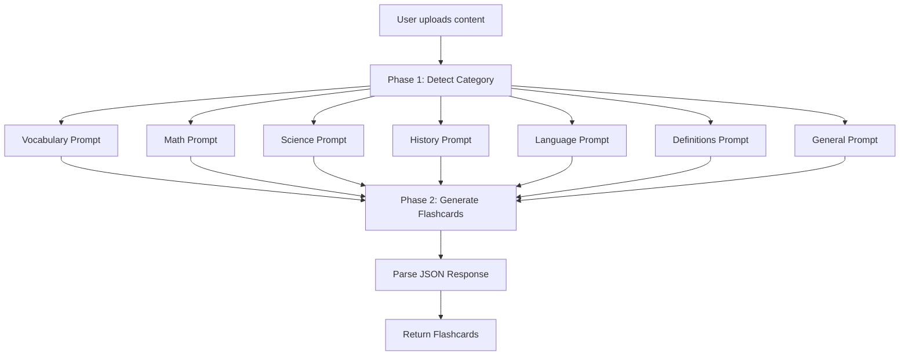

# Specialized AI Flashcard Generation System

## Overview

Transform the current single-prompt system into a multi-prompt system that automatically detects content type and uses specialized prompts for different subjects.

## Implementation Strategy

### 1. Content Type Detection

Add a two-phase AI approach:

- **Phase 1**: Analyze the content and detect the subject category
- **Phase 2**: Generate flashcards using the specialized prompt for that category

### 2. Specialized Prompts

Create distinct prompts for each category in [`src/utils/aiFlashcardGenerator.ts`](src/utils/aiFlashcardGenerator.ts):

**Vocabulary** (Minimal)

- Front: Single word only
- Back: Primary meaning/definition only
- No example sentences or extra context

**Math**

- Front: Problem statement or concept question
- Back: Solution with step-by-step explanation
- Include formulas when relevant

**Science**

- Front: Concept, principle, or process question
- Back: Clear explanation with key terms
- Include diagrams descriptions when applicable

**History**

- Front: Event, person, or period
- Back: Significance, dates, and context
- Focus on cause-effect relationships

**Language Learning**

- Front: Phrase or sentence in target language
- Back: Translation and usage context
- Include pronunciation notes if relevant

**Definitions/Academic**

- Front: Technical term or concept
- Back: Formal definition and application
- Subject-specific terminology

**General/Other**

- Front: Key concept or question
- Back: Comprehensive answer
- Fallback for mixed content

### 3. Implementation Details

**File Changes:**

- Modify [`src/utils/aiFlashcardGenerator.ts`](src/utils/aiFlashcardGenerator.ts)
  - Replace `SYSTEM_PROMPT` with category-specific prompts object
  - Add `detectContentCategory()` function for Phase 1
  - Add `getPromptForCategory()` function to select appropriate prompt
  - Update `generateFlashcardsFromImage()`, `generateFlashcardsFromText()`, and `generateFlashcardsFromPDF()` to use two-phase generation

**Detection Logic:**

```typescript
Categories: vocabulary | math | science | history | language | definitions | general
```

The AI will analyze keywords, structure, and content patterns to classify automatically.

### 4. Backward Compatibility

- Keep the same function signatures
- No changes needed to UI components
- Same JSON output format `[{front, back}]`

## Architecture Flow



## Benefits

- Better flashcard quality for each subject type
- Vocabulary cards will be clean and minimal
- Math solutions will include step-by-step work
- Science cards will focus on understanding concepts
- No user intervention required (automatic detection)